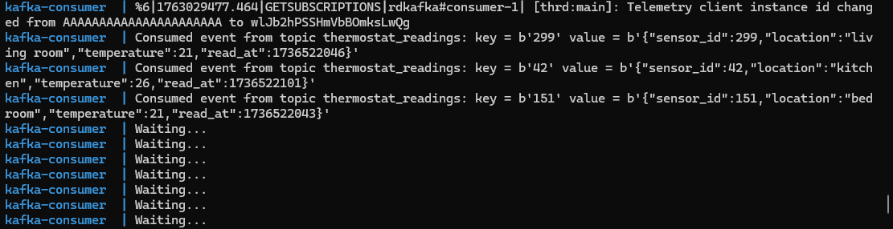
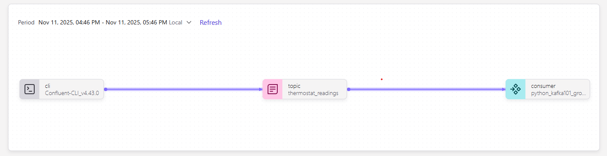
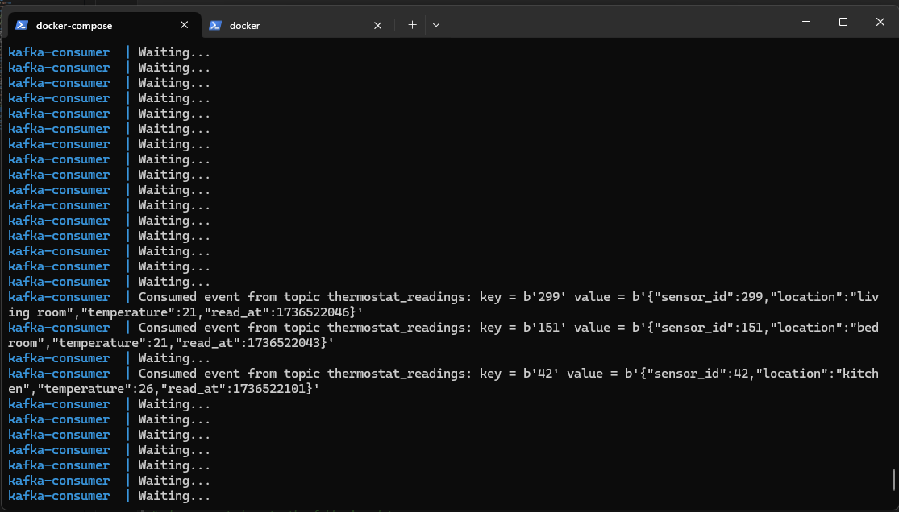

# Lesson 9: Hands-on Exercise: Kafka Consumer

Source of learning: https://developer.confluent.io/courses/apache-kafka/exercise-kafka-consumers/

Date: 17 November 2025

We will use `docker compose` because it is easier to setup and we need two terminals.

## Prerequsite

- docker is installed and running

## Step 1: Retrieve config data and setup API key and secret

Run the docker container you created in [lesson-7](../lesson-7-kafka-producer/readme.md) or create a new container.

```sh
# run previous container
docker start confluent-cli && docker exec -it confluent-cli sh

# OR

# create a new container
docker run \
-it \
--name confluent-cli \
confluentinc/confluent-cli:4.43.0 sh
```

Then login your confluent cli.

```sh
# login your confluent-cli
confluent login --save
```

Determine your environment id and cluster id, and note down `Endpoint` from printed result.

```sh
# select environment & cluster
confluent environment use <ENV_ID> && confluent kafka cluster use <CLUSTER_ID>

# print cluster details with `Endpoint`
confluent kafka cluster describe
```

Create new API key or attach your existing API key and secret.

```sh
# Create a new key
confluent api-key create --resource <CLUSTER_ID>

# or

# Store the existing key
confluent api-key store --resource <Cluster_Id> <API_Key> <API_Secret>


# Then use the target key
confluent api-key use <API Key> --resource <CLUSTER_ID>
```

Save the following data for our **config.ini** file.

- Endpoint
- API Key
- API secret

## Step 2: Create **config.ini** file

Create a **config.ini** with content below, replacing `< >` data with our data.

```ini
[default]
bootstrap.servers=< Endpoint >
security.protocol=SASL_SSL
sasl.mechanisms=PLAIN
sasl.username=< API Key >
sasl.password=< API Secret >

[consumer]
group.id=python_kafka101_group_1
# 'auto.offset.reset=earliest' to start reading from the beginning of
# the topic if no committed offsets exist.
auto.offset.reset=earliest
```

Here is the [sample file](./config.ini.sample)

## Step 3: Create Python consumer script **consumer.py**

Follow the tutorial, create a file name **consumer.py** with following content.

This file does the following:

1. parse the **config.ini** file and attach the config data to the consumer instance
2. subscribe to topic "thermostat_readings"
3. run a while loop to poll message from Kafka

```python
#!/usr/bin/env python
from argparse import ArgumentParser, FileType
from configparser import ConfigParser
from confluent_kafka import Consumer
if __name__ == '__main__':
    # Parse the command line.
    parser = ArgumentParser()
    parser.add_argument('config_file', type=FileType('r'))
    args = parser.parse_args()

    # Parse the configuration.
    config_parser = ConfigParser()
    config_parser.read_file(args.config_file)
    config = dict(config_parser['default'])
    config.update(config_parser['consumer'])

    # Create Consumer instance
    consumer = Consumer(config)

    # Subscribe to topic
    topic = "thermostat_readings"
    consumer.subscribe([topic])

    # Poll for new messages from Kafka and print them.
    try:
        while True:
            msg = consumer.poll(1.0)
            if msg is None:
                print("Waiting...")
            elif msg.error():
                print("ERROR: %s".format(msg.error()))
            else:
                # Extract the (optional) key and value, and print.
                print("Consumed event from topic {topic}: key = {key} value = {value}".format(topic=msg.topic(), key=msg.key(), value=msg.value()))
    except KeyboardInterrupt:
        pass
    finally:
        # Leave group and commit final offsets
        consumer.close()
```

## Step 4: Create **Dockerfile** for the Python consumer script

Create a **Dockerfile** with content below.

```dockerfile
# current directory /lesson-9-kafka-consumer
FROM python:3

WORKDIR /app

COPY ./consumer.py consumer.py
COPY ./config.ini config.ini

RUN python3 -m venv env

# Need to be absolute path for the OS to know the locations of the executables
# GrokAI (verified)
ENV PATH="/app/env/bin:$PATH"

# Ensure python output stdout are sent straight to terminal
# https://stackoverflow.com/questions/59812009/what-is-the-use-of-pythonunbuffered-in-docker-file
ENV PYTHONUNBUFFERED=1

# Activate the environment
RUN . env/bin/activate

RUN pip install confluent-kafka

# Make the file into executable
RUN chmod u+x consumer.py

# Execute this when container is ready
CMD ["python","consumer.py","config.ini"]
```

## Step 5: Create **docker-compose.yml** file

Create file **docker-compose.yml** with following content.

It will create two services(container), "kafka-consumer"(python) and "compose-confluent-cli".

"kafka-consumer" will be built based on previously created **Dockefile**.

```yml
# current directory /lesson-9-kafka-consumer
version: "3.8"

services:
  kafka-consumer:
    container_name: kafka-consumer
    build:
      context: .

  confluent-cli:
    container_name: compose-confluent-cli
    image: confluentinc/confluent-cli:4.43.0
    # solution: https://stackoverflow.com/a/39150040/7939633
    stdin_open: true # docker run -i
    tty: true # docker run -t
```

## Step 6: Run `docker compose`

Run command below and it will attach the container `kafka-consumer` in the main terminal.

```sh
# in directory /apache-kafka-101-with-confluent
docker-compose -f lesson-9-kafka-consumer/docker-compose.yml up --build --attach kafka-consumer
```

## Step 7: Verify consumer result

Your terminal should show the earliest messages in the Topic - thermostat_readings and subsequently waiting for new messages.



You can check out the created consumer in Confluent Cloud:

Go to **Environment**>**Cluster**>**Topics**>**thermostat_readings**

You will find the workflow with a new consumer named "python_kafka101_group_1"



## Step 8: Real time consumer testing

To test on real time message polling, we are require to connect to the container "compose-confluent-cli".

Follow the [methods](../lesson-7-kafka-producer/readme.md#3-open-a-new-terminal-to-produce-more-messages) here to use confluent cli as a producer to send a messages.

TLDR: Open a new terminal and run the commands below.

```sh
# Connect to the confluent cli from the `docker compose`
docker exec -it compose-confluent-cli sh

# Login
confluent login --save

# select environment & cluster
confluent environment use <ENV_ID> && confluent kafka cluster use <CLUSTER_ID>

# Store the existing key
confluent api-key store --resource <Cluster_Id> <API_Key> <API_Secret>

# Use the target key
confluent api-key use <API Key> --resource <CLUSTER_ID>

# Produce messages
confluent kafka topic produce thermostat_readings --parse-key

# Submit the messages

# when prompted paste the following data
299:{"sensor_id":299,"location":"living room","temperature":21,"read_at":1736522046}
151:{"sensor_id":151,"location":"bedroom","temperature":21,"read_at":1736522043}
42:{"sensor_id":42,"location":"kitchen","temperature":26,"read_at":1736522101}
```

## Step 9: Verify live consumer events

In the same terminal, you can see the consumed events.



## Help

### 1. How to reset the kafka partition offset?

If you wish to reset the offset to let consumer to consumer from the beginning again, you can go to Confluent Cloud Platform:

**Environment** > **Cluster** > **Clients** > **Consumer lag** > **Consumer Group ID** > Check all Topics > Click button "Reset Offset" > Then select "Earliest"

You can verify the offset is removed via Confluent Cloud.

**Topics** > **thermostat_readings** > **Overview**

You will find that the consumer had disappeared from the lineage flow.

[Source](https://docs.confluent.io/cloud/current/client-apps/offsets-consumer.html#reset-an-offset)

## Good to have for this tutorial

- [ ] Create a python producer script/postman script instead of login confluent cli to post messages
- [ ] Reduce redundancy to login to compose-confluent-cli until store api key again in `docker compose`
